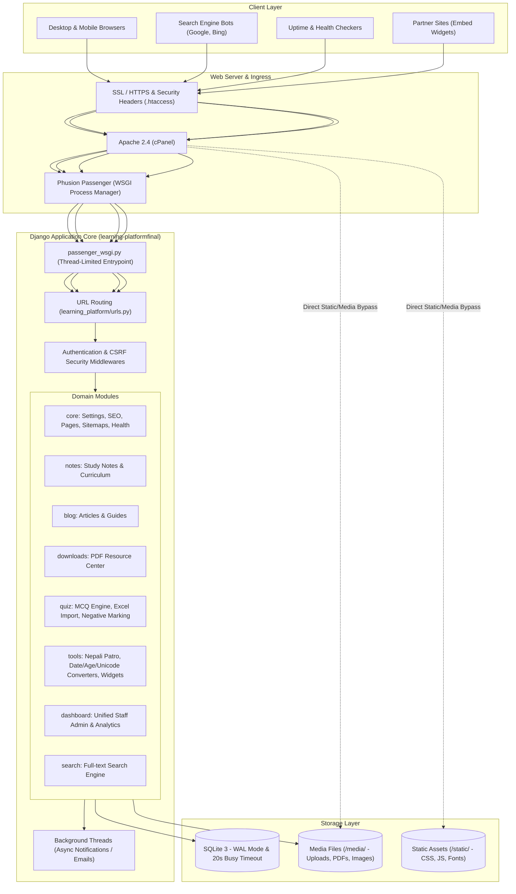
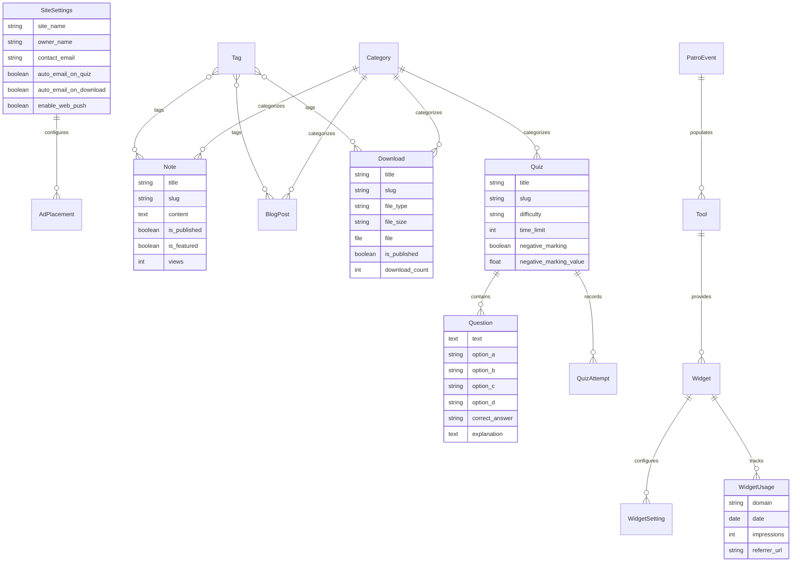
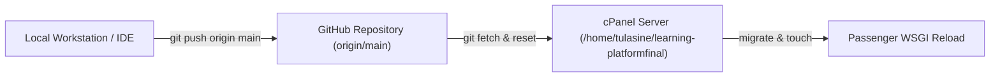

# System Architecture Documentation

**Platform:** Tulasi Nepali Educational & Utility Platform  
**Production URL:** [https://tulasinepali.com.np](https://tulasinepali.com.np)  
**Framework:** Django 5.x (Python 3.10+)  
**Runtime:** Phusion Passenger WSGI on Apache (cPanel Shared Hosting / Linux)  
**Database:** SQLite 3 with Write-Ahead Logging (WAL Mode)  

---

## 1. High-Level System Architecture

The application employs a layered Model-View-Template (MVT) architecture with decoupled background task delegation, static asset delegation, and real-time monitoring:



---

## 2. Directory & Application Structure

```text
├── blog/                      # Educational articles, categories, view counters
├── core/                      # Global settings, context processors, legal pages, emails, health checks
├── dashboard/                 # Custom administrative interface (notes, quizzes, downloads, tools, analytics)
├── downloads/                 # Downloadable PDFs, past papers, auto-size/type detection
├── learning_platform/         # Django project configuration (settings.py, urls.py, wsgi.py)
├── media/                     # Uploaded files (notes, downloads, site branding)
├── notes/                     # Curriculum notes, study material categories
├── public/                    # Production document root (.htaccess, static robots.txt, ads.txt)
├── quiz/                      # MCQ quiz engine, questions, Excel/CSV importer, attempts tracking
├── search/                    # Unified multi-module search engine
├── static/                    # Source CSS, JavaScript, vendor libraries (AdminLTE, Bootstrap, CKEditor)
├── staticfiles/               # Collected production static assets (via collectstatic)
├── templates/                 # Global and app-level Jinja/Django HTML templates
│   ├── core/                  # Homepage, about, contact, disclaimer, sitemap, 404, 500
│   ├── dashboard/             # Admin portal pages, tool management, analytics
│   ├── downloads/             # Public downloads directory and detail pages
│   ├── notes/                 # Public notes listings and reading view
│   ├── quiz/                  # Public MCQ quiz taker and result scorecard
│   ├── tools/                 # Nepali Patro, Date Converter, Age Calculator, Unicode
│   └── widgets/               # Embeddable widget templates (Patro, etc.)
├── tools/                     # Utility tools, embeddable widgets, analytics tracking
├── passenger_wsgi.py          # Phusion Passenger WSGI entry point
├── db.sqlite3                 # Primary database (WAL Mode)
├── manage.py                  # Django CLI utility
└── requirements.txt           # Python package dependencies
```

---

## 3. Core Data Architecture & Entity Relationship



---

## 4. Key Subsystem Implementations

### 4.1. Concurrency & Database Engine
- **Engine:** SQLite 3 optimized for high read/write throughput on shared hosting.
- **WAL Mode (Write-Ahead Logging):** Configured via Django's `connection_created` signal:
  - `PRAGMA journal_mode=WAL;`
  - `PRAGMA busy_timeout=20000;` (20-second lock resolution threshold)
  - `PRAGMA synchronous=NORMAL;`
- **Concurrency Benefit:** Readers never block writers; writers never block readers. Prevents `OperationalError: database is locked` during spikes.

### 4.2. Passenger WSGI Process & Thread Management
To strictly respect CloudLinux LVE process and thread limits (`RLIMIT_NPROC`):
```python
# passenger_wsgi.py
import os
os.environ["OPENBLAS_NUM_THREADS"] = "1"
os.environ["OMP_NUM_THREADS"] = "1"
os.environ["MKL_NUM_THREADS"] = "1"
os.environ["VECLIB_MAXIMUM_THREADS"] = "1"
os.environ["NUMEXPR_NUM_THREADS"] = "1"
```
This prevents external linear algebra libraries from spawning unmanaged worker pools that trigger cPanel worker terminations (`SIGTERM / signal 15`).

### 4.3. Asynchronous Non-Blocking Event Notifications
- Content publication triggers in `Note.save()`, `Download.save()`, and `Quiz.save()` dispatch automated emails via `core.emails.trigger_auto_email_notification()`.
- Broadcast execution is delegated to dedicated **daemon background threads** (`threading.Thread(daemon=True).start()`) with a 10-second socket timeout.
- This guarantees HTTP response latency for dashboard operations remains below **50ms**, eliminating web server gateway timeouts (504/500).

### 4.4. Automated Slug & Asset Processing
- **Universal Slugging:** `auto_generate_slug()` handles ASCII and Devanagari (Nepali Unicode) titles. If ASCII conversion yields an empty token, a collision-resistant unique slug is generated (`prefix-<hash>`).
- **Download Automation:** Uploaded resources auto-detect MIME categories (`pdf`, `docx`, `ppt`, `zip`) and auto-calculate formatted file sizes (`KB` / `MB`) if omitted by the staff user.
- **Directory Verification:** Target media paths (`media/downloads/`, `media/downloads/thumbnails/`) are verified and created on-the-fly (`os.makedirs(..., exist_ok=True)`).

### 4.5. Embeddable Widget & Domain Analytics
- **Cross-Origin Embedding:** Security middleware conditionally permits `X-Frame-Options` on `/widgets/embed/*` while enforcing `SAMEORIGIN` on the rest of the application.
- **Analytics Ingestion:** The `/tools/widgets/api/track/<slug>/` endpoint records impressions and host domain names asynchronously via `navigator.sendBeacon` and image beacons, collating domain telemetry into `WidgetUsage`.

### 4.6. SEO, Discovery & Health Monitoring
- **Real-Time Dynamic Sitemap:** [core/sitemap.xml](templates/core/sitemap.xml) executes live database queries across published notes, blogs, quizzes, and downloads on each request. No scheduled regeneration or cron is required.
- **Crawler Directives:** Dedicated `/robots.txt` route delivers structured allow/disallow indexes and links directly to the canonical XML sitemap.
- **Health Endpoints:**
  - `GET /health/`: Returns JSON `{"status": "healthy", "database": "connected"}` (`200 OK`) after executing a live database query (`SELECT 1`).
  - `GET /up/`: Lightweight uptime probe endpoint for third-party monitoring services (UptimeRobot, Pingdom, BetterUptime).
  - `GET /favicon.ico`: Failsafe handler redirecting to the active brand icon or serving a minimal 1x1 ICO stream to prevent 404 access log errors.

---

## 5. Security & Protection Layer

| Layer | Mechanism | Configuration |
| :--- | :--- | :--- |
| **Transport** | HSTS (Strict-Transport-Security) | `max-age=31536000; includeSubDomains; preload` |
| **Framing** | Clickjacking Defense | `X-Frame-Options: SAMEORIGIN` (Whitelisted for `/widgets/embed/*`) |
| **Content Security** | Content-Security-Policy (CSP) | Whitelisted CDNs (jsDelivr, cdnjs, Google Ads, GTM, Google Fonts) |
| **MIME Sniffing** | X-Content-Type-Options | `nosniff` enforced at Apache level |
| **CSRF** | Anti-CSRF Token Validation | Enforced across all state-changing POST requests |
| **Authentication** | Password Hashing | PBKDF2 with SHA-256 |
| **Admin Cloaking** | Honeypot Traps | `django-admin-honeypot` deployed at `/admin/` with custom route for staff |
| **Access Control** | Role-Based Authorization | `@staff_member_required` decorator across `/dashboard/*` |

---

## 6. Deployment & Server Operations

### Continuous Deployment Workflow


### Production Sync Command
To pull, migrate, and reload the production instance via cPanel Terminal:
```bash
cd ~/learning-platformfinal && git fetch origin main && git reset --hard origin/main && source ~/virtualenv/learning-platformfinal/3.10/bin/activate && python manage.py migrate && touch passenger_wsgi.py
```
