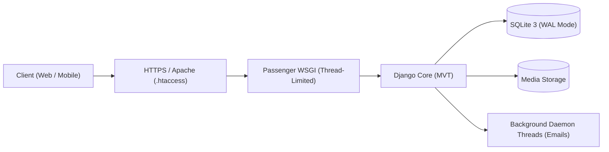

# Tulasi Nepali - Educational & Utility Platform

[](https://www.djangoproject.com/)
[](https://www.python.org/)
[](https://tulasinepali.com.np)
[](ARCHITECTURE.md)

**Live Website:** [https://tulasinepali.com.np](https://tulasinepali.com.np)

An open educational and utility web platform providing study curriculum, competitive examination practice (Lok Sewa / PSC, Computer Operator, TSC, Banking), curriculum downloads, and Nepali daily utilities.

---

## 🌟 Key Features

- **Practice Hub & MCQ Engine:**
  - Mock exams with configurable negative marking (e.g. -20% per wrong answer).
  - Bulk question import via Excel / CSV format.
  - Interactive scorecard, timing metrics, and explanation reviews.
- **Curriculum & Study Notes:**
  - Rich text study notes powered by CKEditor 5.
  - Modular category structure across computing, GK, constitution, and exams.
- **Resource Download Center:**
  - PDF syllabus, past exam papers, and model question papers.
  - Automatic file type detection and file size calculations.
- **Nepali Utilities & Embeddable Widgets:**
  - **Nepali Patro (Calendar):** BS calendar with Bikram Sambat dates, Tithi, festivals, and public holidays.
  - **Date Converter:** Bi-directional BS ↔ AD conversion engine.
  - **Age Calculator:** Exact age in years, months, and days with next birthday calculation.
  - **Preeti to Unicode Converter:** High-fidelity legacy Preeti text to Unicode converter.
  - **Embeddable Widgets:** Iframe-friendly embeddable widgets with real-time domain analytics.
- **Staff Administration Portal (`/dashboard/`):**
  - Unified management for Notes, Quizzes, Downloads, Blog, Tools, Widgets, Holidays, and Site Settings.
  - Real-time Widget Embed Analytics and domain tracking.
  - Bulk holiday/event import via JSON and CSV.
- **High-Performance & SEO Architecture:**
  - Live dynamic `sitemap.xml` with zero regeneration lag.
  - Dedicated `/robots.txt` crawler directives.
  - High-availability `/health/` and `/up/` health-check endpoints.
  - SQLite with Write-Ahead Logging (WAL mode) and 20s lock timeout.

---

## 📐 System Architecture

For a complete breakdown of the technical design, data models, entity relationships, security layers, and concurrency strategy, view the **[System Architecture Documentation (ARCHITECTURE.md)](ARCHITECTURE.md)**.



---

## 🚀 Local Development Setup

### 1. Clone & Environment
```bash
git clone https://github.com/tulasinepali/Final-mysite.git
cd Final-mysite
python -m venv venv
# Windows:
venv\Scripts\activate
# Linux/macOS:
source venv/bin/activate
```

### 2. Install Dependencies
```bash
pip install -r requirements.txt
```

### 3. Database Migration & Setup
```bash
python manage.py migrate
python manage.py createsuperuser
```

### 4. Run Development Server
```bash
python manage.py runserver
```
Visit `http://127.0.0.1:8000/` in your browser.

---

## 🚢 Production Deployment (cPanel / Phusion Passenger)

To synchronize updates to your live cPanel server:

```bash
cd ~/learning-platformfinal && git fetch origin main && git reset --hard origin/main && source ~/virtualenv/learning-platformfinal/3.10/bin/activate && python manage.py migrate && touch passenger_wsgi.py
```

---

## 📄 License & Credits

- **Platform Author:** Tulasi Nepali
- **Platform Domain:** [tulasinepali.com.np](https://tulasinepali.com.np)
- **Built With:** Django, Bootstrap 5, AdminLTE, FontAwesome, CKEditor 5, and Phusion Passenger.
